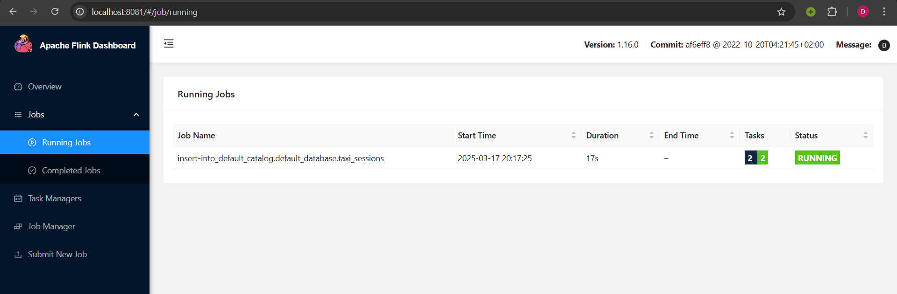
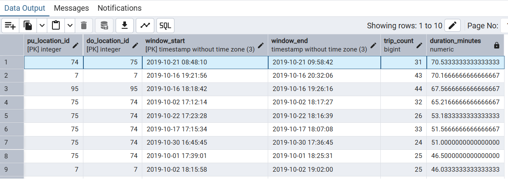

# 06-Streaming Module hw
In this homework, I learned how to work with streaming data using PyFlink and Redpanda (which is basically a drop-in replacement for Kafka). Here's how I completed each task and what I learned along the way.

## My Setup Process

First, I had to get all the required containers running:

```bash
cd ../../../06-streaming/pyflink/
docker-compose up -d
```

This started several containers:
- Redpanda (Kafka replacement)
- Flink Job Manager
- Flink Task Manager
- PostgreSQL

I checked that everything was running by visiting the Flink UI at http://localhost:8081.

For easier database management, I also set up pgAdmin:
```bash
cd pgadmin
docker-compose up -d
```

I accessed pgAdmin at http://localhost:5050 using:
- Email: admin@admin.com
- Password: admin

Then I connected to PostgreSQL with these settings:
- Host: host.docker.internal
- Port: 5432
- Username: postgres
- Password: postgres
- Database: postgres

## Question 1: Finding the Redpanda Version

I needed to find out what version of Redpanda was running. I used:
```bash
docker exec -it redpanda-1 rpk version
```

**Answer:** 
Version: v24.2.18,
Git ref: f9a22d4430,
Build date: 2025-02-14T12:52:55Z,
OS/Arch: linux/amd64, Go version: go1.23.1

## Question 2: Creating a Topic

Before sending data, I needed to create a Kafka topic. I ran:
```bash
docker exec -it redpanda-1 rpk topic create green-trips
```

**Answer:** 
```
TOPIC        STATUS
green-trips  OK
```

## Question 3: Testing the Kafka Connection

I installed the Kafka Python library:
```bash
pip install kafka-python
```

Then I created [kafka_connect.py](kafka_connect.py) to test if I could connect to the Redpanda server. When I ran it:
```bash
python kafka_connect.py
```

**Answer:** True

## Question 4: Sending the Taxi Trip Data

I created [send_trips.py](send_trips.py) to read the taxi data from the CSV file and send it to Redpanda. This was tricky because I had to handle datetime conversions properly.

When I ran it:
```bash
python send_trips.py
```


**Answer:** 120.12 seconds to send all the data

## Question 5: Building a Session Window

This was the most challenging part! I had to:

1. Create [session_job.py](session_job.py) to process the streaming data with a 5-minute session window
2. Copy it to the Flink container:
```bash
docker cp session_job.py flink-jobmanager:/opt/flink/session_job.py
```
3. Run the Flink job:
```bash
docker exec -it flink-jobmanager /opt/flink/bin/flink run -py /opt/flink/session_job.py
```


I ran into some issues with the connection to Redpanda at first, but fixed it by using the correct container name and port.

Finally, I queried the results in pgAdmin:
```sql
WITH session_durations AS (
    SELECT 
        pu_location_id,
        do_location_id,
        window_start,
        window_end,
        trip_count,
        EXTRACT(EPOCH FROM (window_end - window_start))/60 as duration_minutes
    FROM taxi_sessions
)
SELECT 
    pu_location_id,
    do_location_id,
    window_start,
    window_end,
    trip_count,
    duration_minutes
FROM session_durations
ORDER BY duration_minutes DESC
LIMIT 10;
```

**Answer:** 



 I found that pickup location 74 and dropoff location 75 had the longest unbroken streak of taxi trips. This streak lasted for 70.53 minutes (from 2019-10-21 08:48:10 to 2019-10-21 09:58:42) and included 31 trips.
