# Stock Market Analytics Platform

A comprehensive data pipeline for stock market data processing and analytics on Google Cloud Platform (GCP). This platform integrates batch processing, real-time streaming, and analytics components to deliver insights from stock market data.

## Architecture Overview

The Stock Market Analytics Platform consists of the following components:

```
                                                  +-------------------+
                                                  |                   |
                                                  |  Looker Studio    |
                                                  |  Visualizations   |
                                                  |                   |
                                                  +--------^----------+
                                                           |
                       Batch Pipeline                      |
+---------------+    +----------------+    +---------------v-----------+
|               |    |                |    |                           |
| Stock Market  +--->+ Dataproc       +--->+                           |
| Data Files    |    | (Spark Jobs)   |    |                           |
|               |    |                |    |                           |
+---------------+    +-------^--------+    |                           |
                             |             |                           |
                             |             |      BigQuery             |
+---------------+    +-------+--------+    |     (Data Storage)        |
|               |    |                |    |                           |
| Stock Market  +--->+ Kafka VM       +--->+                           |
| Data Stream   |    | (Producer/     |    |                           |
|               |    |  Consumer)     |    |                           |
+---------------+    +-------+--------+    +-------------^-------------+
                             |                           |
                             |                           |
                     +-------v---------+       +---------+---------+
                     |                 |       |                   |
                     | Airflow + DBT   +------>+ Transformed Data  |
                     | (Analytics)     |       | Models            |
                     |                 |       |                   |
                     +-----------------+       +-------------------+
                           |
                           | (triggers batch processing once daily)
                           |
                           v
```

This architecture combines:
1. **Batch Processing**: Using Dataproc (managed Spark) for processing historical data
2. **Real-time Streaming**: Using Kafka for streaming real-time stock market data
3. **Data Storage**: BigQuery for storing raw and processed data
4. **Analytics**: Airflow and DBT for orchestration and data transformation
   - **Daily Batch Updates**: Airflow triggers Dataproc jobs once a day to process the latest stock data
5. **Visualization**: Connected to Looker Studio for data visualization

## Dashboard Visualizations

Below are the key dashboards created for the Stock Market Analytics platform:

1. 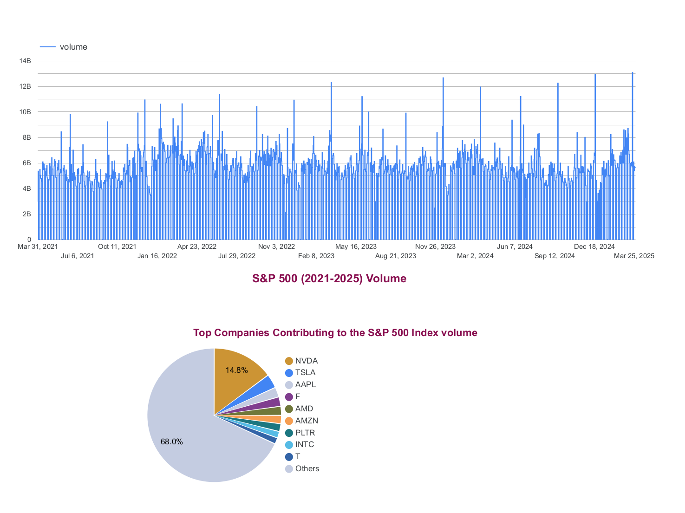 - Bar chart comparing trading volume and price for selected stocks (NVDA, TSLA, AMZN, etc.) with hourly updates.

2. 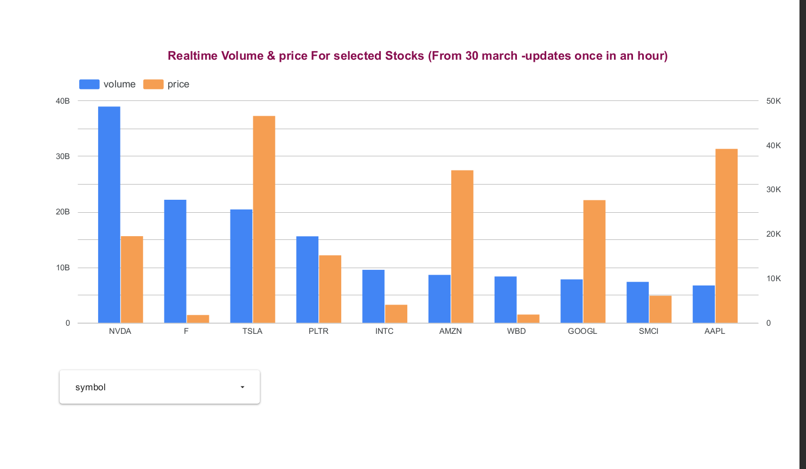 - Comparison of different moving average periods (10, 20, 50-day) across various stocks, with NVR showing the highest values.

3. 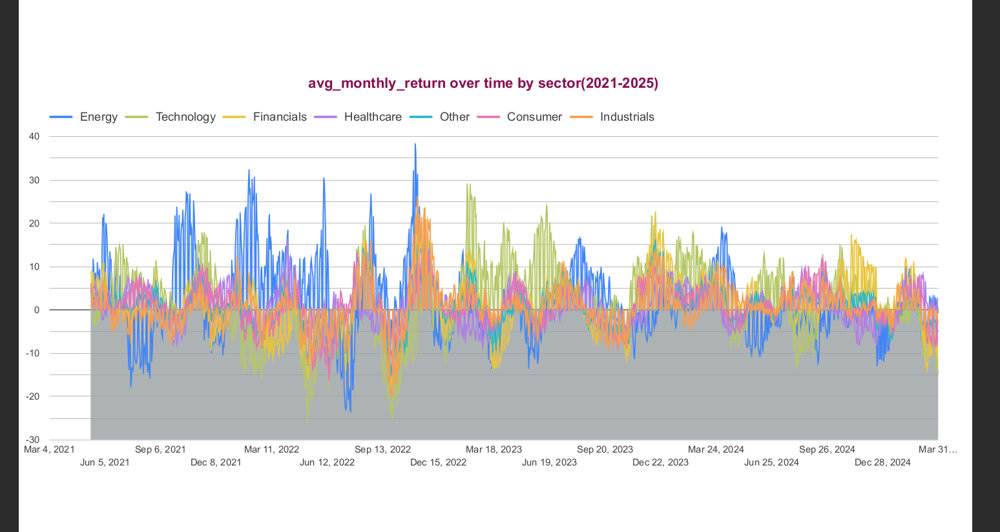 - Time series analysis of S&P 500 trading volume over a four-year period, along with a pie chart showing top contributing companies.

4. 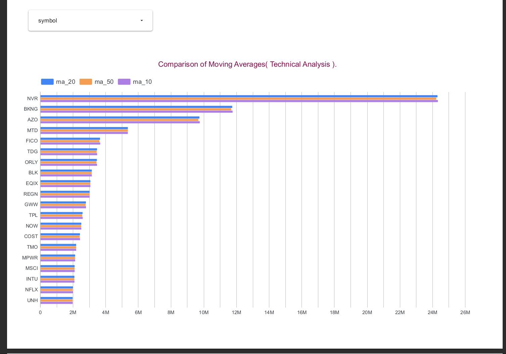 - Line chart tracking average monthly returns across different market sectors including Technology, Energy, and Financials.

5. 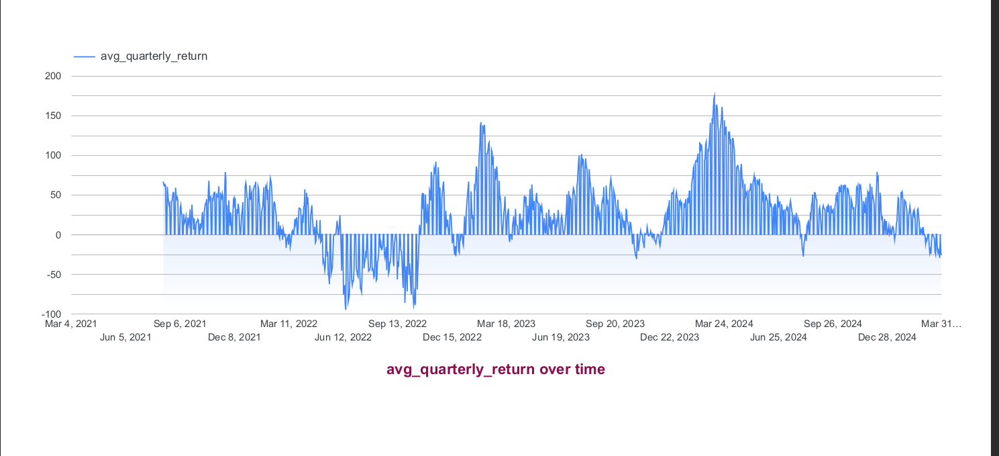 - Key performance metrics including record count, total volume, RSI indicators, and market sentiment score with real-time weekly trend analysis.

6. 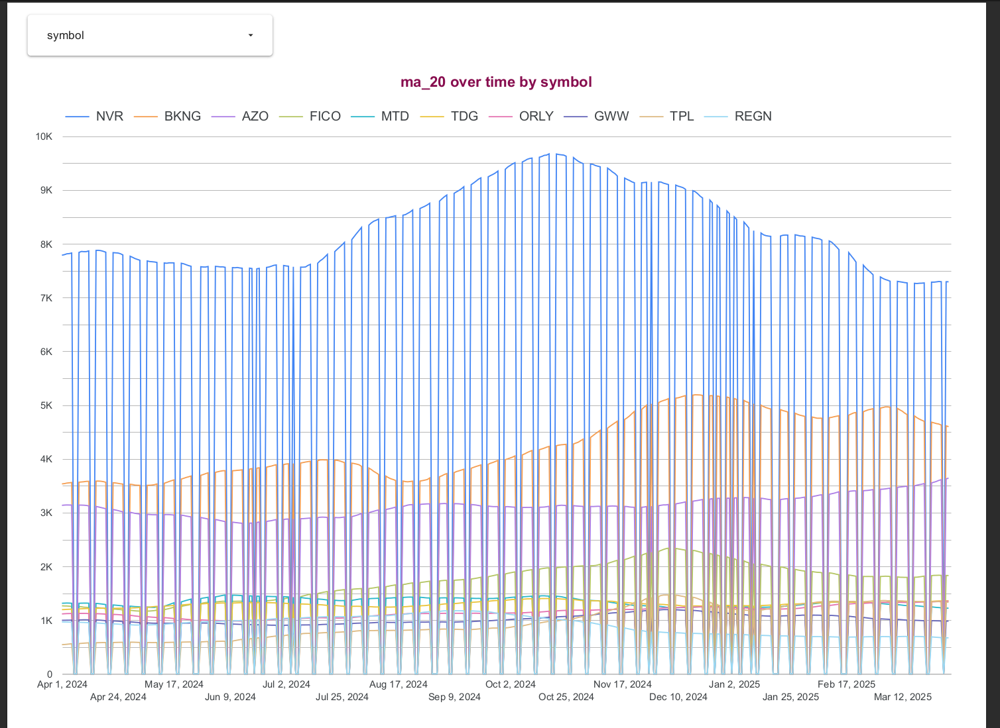 - Time series visualization of 20-day moving averages for selected stocks (NVR, BKNG, AZO) showing price momentum over time.

7. 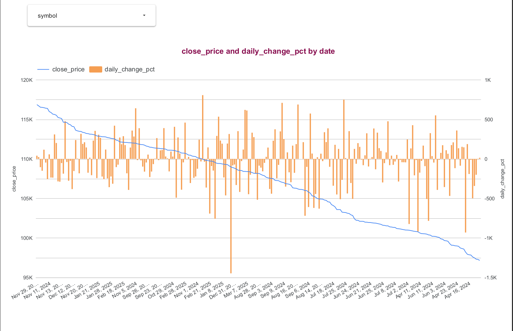 - Chart displaying average quarterly returns over a four-year period, showing cyclical patterns and volatility in market performance.

8. 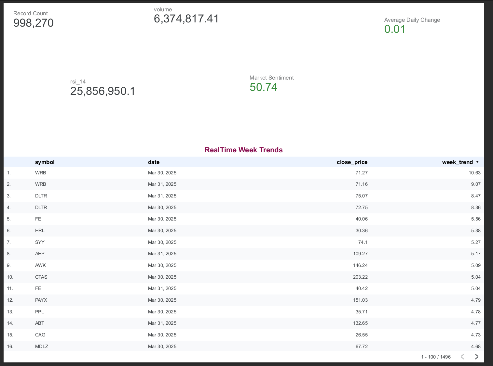 - Combined visualization of closing price (line) and daily percentage change (bars) showing price trajectory and volatility over time.

9. 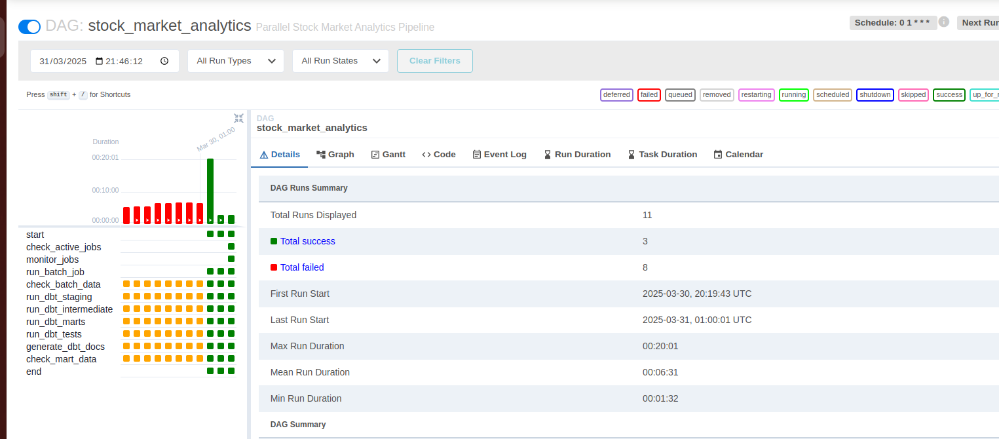 - The Airflow web interface showing DAG schedules, execution history, and logs. DAGs trigger DBT transformations and batch processing jobs on a scheduled basis, orchestrating the entire pipeline workflow.

10. 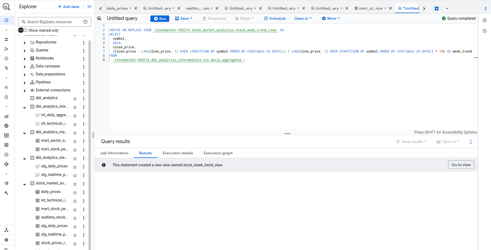 - The BigQuery interface showing datasets, tables, and query results. This is where all processed data from both batch and streaming pipelines is stored, queried, and analyzed.

11. 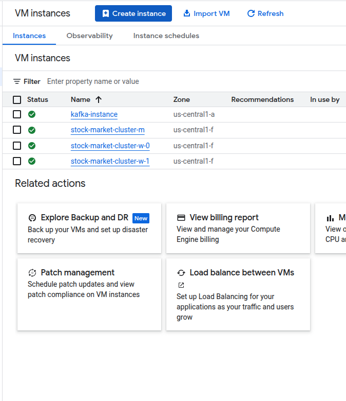 - The Google Cloud VM dashboard displaying Kafka instance details, performance metrics, and connectivity options. This VM hosts the Kafka broker, Zookeeper, Airflow, and related components of the streaming pipeline.

## Data Visualization

The project is integrated with Looker Studio for visualization:

1. Access the dashboard: [Stock Market Analytics Dashboard](https://lookerstudio.google.com/reporting/95d2f78e-eaf8-4607-bc53-6aa5d758186d)


## Prerequisites

1. **Google Cloud Platform Account**:
   - An active GCP project with billing enabled
   - Required APIs enabled (Compute Engine, BigQuery, Dataproc, etc.)

2. **Required Tools**:
   - Google Cloud SDK (`gcloud`)
   - Terraform (>= 1.0.0)
   - Git

3. **Authentication**:
   ```bash
   gcloud auth application-default login
   gcloud auth login
   gcloud config set project YOUR_PROJECT_ID
   ```

## Detailed Cloud Deployment Guide

### 1. Initial Setup

1. **Clone this repository**:
   ```bash
   git clone https://github.com/Deathslayer89/DTC_DATAENGG.git
   cd stock-market-analytics
   ```

2. **Configure your environment**:
   Create a `.env` file with your GCP configuration (you can copy from `.env.example`):
   ```bash
   cp .env.example .env
   # Edit .env with your specific GCP project details
   ```

   Key configurations include:
   - `PROJECT_ID`: Your GCP project ID
   - `REGION`: GCP region for deployment (default: us-central1)
   - `ZONE`: Specific zone for VM instances (default: us-central1-a)
   - `BUCKET_NAME`: Cloud Storage bucket name for data and assets
   - `DATASET_ID`: BigQuery dataset name for analytics

### 2. Infrastructure Deployment (Terraform)

The project uses Terraform to provision GCP infrastructure including:
- Cloud Storage buckets for raw data
- BigQuery datasets for analytics
- Service accounts with appropriate IAM permissions
- Network configuration for Kafka VM and Dataproc cluster

To deploy the infrastructure:

```bash
# Navigate to the terraform directory
cd terraform

# Initialize Terraform
terraform init

# Review the execution plan
terraform plan -var-file=terraform.tfvars

# Apply the infrastructure changes
terraform apply -var-file=terraform.tfvars

# Return to the project root
cd ..
```

You can customize the deployment by modifying `terraform.tfvars` and `main.tf` as needed.

### 3. Deploy Pipeline Components

You can deploy all components at once or selectively using the unified deploy script:

```bash
# Make the script executable
chmod +x deploy.sh

# Deploy all components (infrastructure, batch, streaming, analytics)
./deploy.sh

# Or deploy selectively
./deploy.sh --enable-terraform true --enable-batch true --enable-streaming true --enable-analytics true
```

### Important Infrastructure Note

⚠️ If you're planning to deploy individual components separately (instead of using the unified deploy.sh script), be aware that you **must run Terraform first** to set up the required infrastructure.

```bash
# First, deploy infrastructure using Terraform
cd terraform
terraform init
terraform apply -var-file=terraform.tfvars
cd ..

# Then deploy individual components
./spark_pipeline/deploy_spark.sh
# or
./stream_pipeline/deploy_streaming_kafka.sh
# or
./analytics/deploy_analytics.sh
```

The unified deploy.sh script handles this sequence automatically when the `--enable-terraform true` flag is set, but if you're running individual deployment scripts directly, you need to ensure the cloud infrastructure exists first. Attempting to deploy Spark, Kafka, or Airflow components without the underlying infrastructure will result in deployment failures.

#### 3.1 Batch Processing (Spark Pipeline)

The batch pipeline uses Dataproc for Spark-based processing:

```bash
# Deploy only the batch pipeline
./spark_pipeline/deploy_spark.sh
```

This script:
1. Creates a Dataproc cluster with the specified configuration
2. Uploads the Spark job and initialization scripts
3. Configures dependencies and environment
4. Submits the Spark job that processes historical stock market data
5. Writes results to BigQuery

The main Spark processing job is defined in `spark_pipeline/run_processor_4y.py`, which:
- Reads historical stock data from Cloud Storage
- Performs ETL operations including data cleansing and transformation
- Calculates key metrics (moving averages, volatility)
- Writes processed data to BigQuery tables

#### 3.2 Streaming Pipeline (Kafka)

The streaming pipeline uses a Kafka VM instance for real-time data processing:

```bash
# Deploy only the streaming pipeline
./stream_pipeline/deploy_streaming_kafka.sh
```

This script:
1. Creates a VM instance for Kafka using Compute Engine
2. Installs and configures Kafka, Zookeeper, and dependencies
3. Sets up the Kafka producer (`kafka_stock_producer.py`) for real-time stock data
4. Configures the Kafka consumer (`kafka_to_bigquery.py`) to stream data to BigQuery
5. Establishes service accounts and permissions

The Kafka producer simulates real-time stock market data, while the consumer processes these messages and writes them to BigQuery using streaming inserts.

#### 3.3 Analytics Layer (Airflow + DBT)

The analytics layer uses Airflow for orchestration and DBT for data transformations:

```bash
# Deploy only the analytics layer
./analytics/deploy_analytics.sh
```

This deploys:
1. Airflow for workflow orchestration
2. DBT for data transformations
3. Scheduled DAGs that run DBT models
4. Monitoring and logging integration

### 4. Updating and Maintaining Pipelines

#### 4.1 Updating Airflow DAGs

To update Airflow DAGs:

1. Modify the DAG files in `analytics/dags/`
2. Upload the updated files to the Kafka VM:
   ```bash
   gcloud compute scp analytics/dags/stock_market_dag.py ${KAFKA_INSTANCE_NAME}:~/airflow/dags/ --zone=${ZONE}
   ```
3. Restart Airflow to apply changes:
   ```bash
   gcloud compute ssh ${KAFKA_INSTANCE_NAME} --zone=${ZONE} --command="sudo systemctl restart airflow-webserver airflow-scheduler"
   ```

#### 4.2 Updating DBT Models

To update DBT models:

1. Modify the models in `analytics/dbt/models/` (staging, intermediate, marts)
2. Upload the changes to the Kafka VM:
   ```bash
   gcloud compute scp -r analytics/dbt/models/ ${KAFKA_INSTANCE_NAME}:~/dbt/ --zone=${ZONE}
   ```
3. Run DBT to apply changes:
   ```bash
   gcloud compute ssh ${KAFKA_INSTANCE_NAME} --zone=${ZONE} --command="cd ~/dbt && ./run_dbt.sh run"
   ```

DBT transformation layers:
- `staging`: Initial data cleaning models
- `intermediate`: Joined and transformed data
- `marts`: Final analytics models for reporting

#### 4.3 Updating Spark Jobs

To update Spark batch jobs:

1. Modify the Spark job files in `spark_pipeline/`
2. Submit the updated job to Dataproc:
   ```bash
   gcloud dataproc jobs submit pyspark spark_pipeline/run_processor_4y.py \
     --cluster=${SPARK_CLUSTER_NAME} \
     --region=${REGION} \
     --jars=gs://spark-lib/bigquery/spark-bigquery-latest_2.12.jar \
     -- --project_id=${PROJECT_ID} --bucket_name=${BUCKET_NAME} --dataset_id=${DATASET_ID}
   ```

### 5. Monitoring and Troubleshooting

#### 5.1 Monitoring Pipelines

1. ****: Access at `http://<KAFKA_VM_IP>:8080` with username `admin`. The Airflow UI allows you to monitor and trigger DAGs that orchestrate DBT transformations and batch processing jobs.

2. ****: View and query your datasets, monitor job execution, and validate data quality. The BigQuery interface provides SQL editors, job history, and data preview capabilities.

3. ****: Monitor Kafka VM performance, resource utilization, and manage SSH connections to the streaming infrastructure.

4. **Cloud Logging**: View logs in GCP Console under Logging

5. **Kafka Monitoring**:
   ```bash
   gcloud compute ssh ${KAFKA_INSTANCE_NAME} --zone=${ZONE}
   
   # Check Kafka topics
   /opt/kafka/bin/kafka-topics.sh --list --bootstrap-server localhost:9092
   
   # Monitor messages
   /opt/kafka/bin/kafka-console-consumer.sh --bootstrap-server localhost:9092 --topic stock-market-data --from-beginning
   ```

#### 5.2 Troubleshooting Common Issues

1. **Terraform Deployment Failures**:
   - Check permissions and API enablement
   - Verify project quota limits
   - Run with increased verbosity: `terraform apply -var-file=terraform.tfvars -debug`

2. **Kafka Connectivity Issues**:
   - Verify firewall rules allow traffic
   - Check Kafka and Zookeeper services: `sudo systemctl status kafka zookeeper`
   - Review logs: `cat /opt/kafka/logs/server.log`

3. **Airflow DAG Failures**:
   - Check Airflow logs in the UI
   - Verify dependencies are installed
   - Check service status: `sudo systemctl status airflow-webserver airflow-scheduler`

4. **DBT Transformation Errors**:
   - Review DBT logs: `cat ~/dbt/logs/dbt.log`
   - Validate SQL syntax and references
   - Test individual models: `cd ~/dbt && ./run_dbt.sh test`